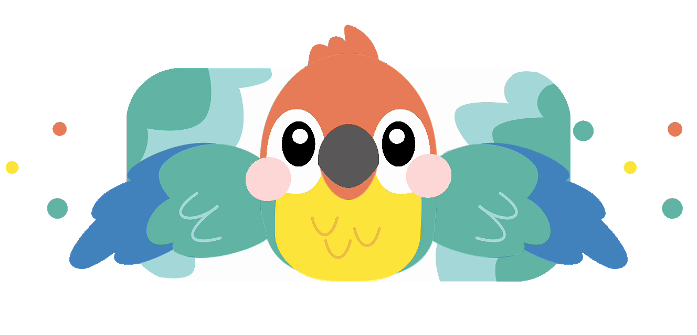
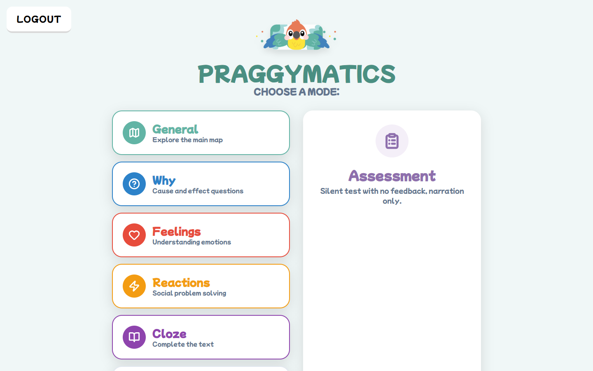
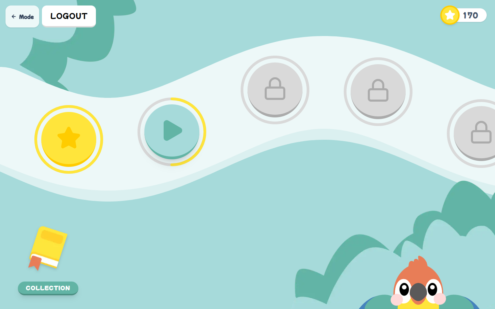
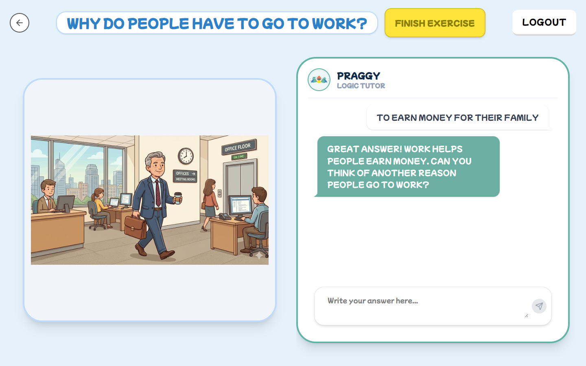
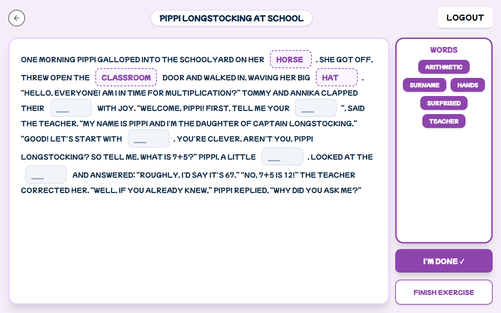
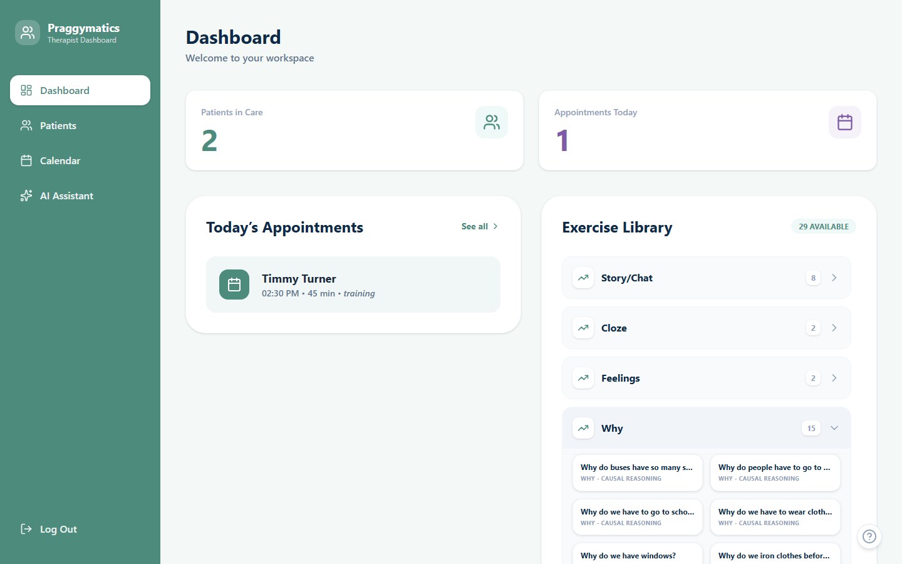
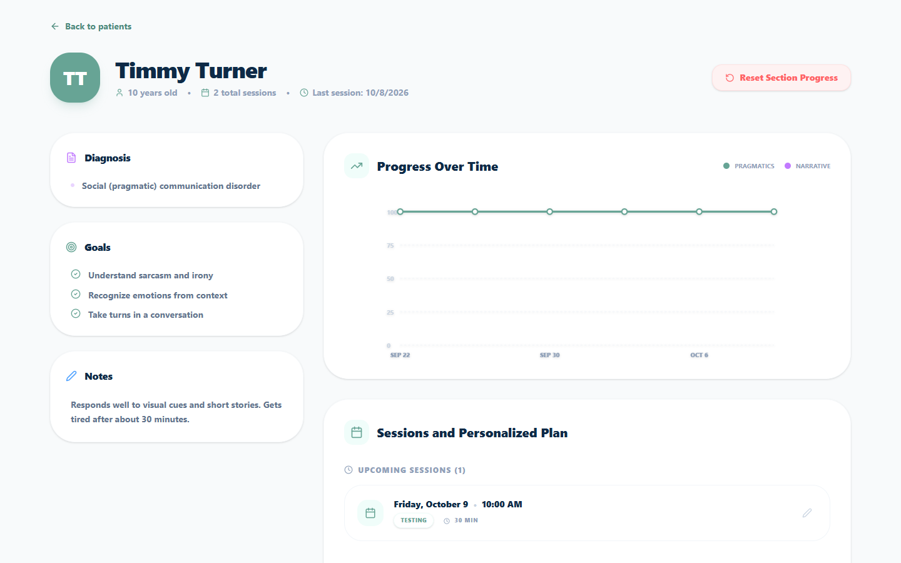
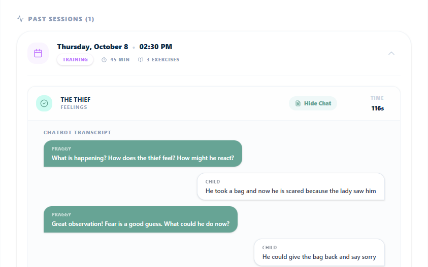
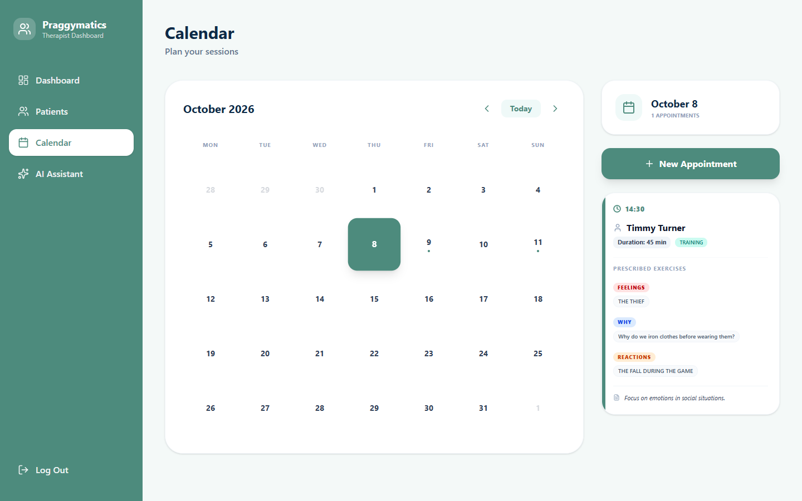

<div align="center">



# Praggymatics

**Learn pragmatics with Praggy!**

A web app where children practice social communication with an AI parrot,<br>
while their speech therapist plans the sessions and follows their progress.

[](https://github.com/ariannabalducci/AUI-Pragmatics/actions/workflows/ci.yml)


[For children](#for-children) · [For therapists](#for-therapists) · [Getting started](#getting-started) · [Documentation](DOCUMENTATION.md) · [Team](#team)

</div>

## For children

Children explore a map of exercises and talk with **Praggy**, an AI tutor that gives hints instead of answers. They can play in **training** mode, with feedback and rewards, or in **assessment** mode, a silent run that gives the therapist an unbiased picture. Every completed exercise earns coins to unlock new parrots for their collection.

| Category | What the child does |
|---|---|
|  | Reads an illustrated story, answers a question, then chats with Praggy about it |
|  | Explains everyday causes and effects (“Why do we wash our hands?”) |
|  | Analyzes a picture of a social situation in three guided steps |
|  | Picks the right reaction to a social situation |
|  | Completes a short story by dragging words into the gaps |

<table>
  <tr>
    <td width="50%"></td>
    <td width="50%"></td>
  </tr>
  <tr>
    <td align="center"><sub>Choosing a category</sub></td>
    <td align="center"><sub>The exercise map</sub></td>
  </tr>
  <tr>
    <td width="50%"></td>
    <td width="50%"></td>
  </tr>
  <tr>
    <td align="center"><sub>A “why” question discussed with Praggy</sub></td>
    <td align="center"><sub>Completing a story</sub></td>
  </tr>
</table>

## For therapists

- **Patients:** diagnosis, goals and private notes, plus a chart of each child's progress.
- **Sessions:** a calendar to schedule sessions and prescribe exercises, synced with Google Calendar.
- **Results:** the outcome of every exercise and the full transcript of each conversation with Praggy.
- **AI assistant:** a chat for evidence-based clinical questions.

<table>
  <tr>
    <td width="50%"></td>
    <td width="50%"></td>
  </tr>
  <tr>
    <td align="center"><sub>Dashboard</sub></td>
    <td align="center"><sub>Patient profile and progress</sub></td>
  </tr>
  <tr>
    <td width="50%"></td>
    <td width="50%"></td>
  </tr>
  <tr>
    <td align="center"><sub>Session results and chatbot transcript</sub></td>
    <td align="center"><sub>Calendar with prescribed exercises</sub></td>
  </tr>
</table>

## Tech stack

| Area | Technology |
|---|---|
| Frontend | Next.js 16 (App Router), React 19, TypeScript, Tailwind CSS 4, Framer Motion |
| Backend | Next.js API routes, Prisma 6, PostgreSQL |
| Authentication | JWT, NextAuth with Google OAuth |
| AI | Azure OpenAI (GPT-4o) |
| Integrations | Google Calendar API |
| Quality | ESLint, TypeScript strict mode, GitHub Actions |

## Getting started

**Prerequisites:** Node.js 20.9 or later, and Docker (or any PostgreSQL database).

1. Install the dependencies:
   ```bash
   npm install
   ```
2. Start a PostgreSQL database:
   ```bash
   docker run --name praggymatics-db -e POSTGRES_PASSWORD=postgres -e POSTGRES_DB=praggymatics -p 5432:5432 -d postgres
   ```
3. Create the `.env` file from the template and fill in the values:
   ```bash
   cp .env.example .env
   ```
4. Create the database schema and load the demo data:
   ```bash
   npx prisma migrate deploy
   npx prisma db seed
   ```
5. Start the app on [http://localhost:3000](http://localhost:3000):
   ```bash
   npm run dev
   ```

<details>
<summary><b>Environment variables</b></summary>
<br>

| Variable | Needed for | Description |
|---|---|---|
| `DATABASE_URL`, `DIRECT_URL` | everything | PostgreSQL connection strings. The defaults in `.env.example` match the Docker command above. |
| `JWT_SECRET` | everything | Secret used to sign the login tokens. |
| `AZURE_OPENAI_ENDPOINT`, `AZURE_OPENAI_API_KEY`, `AZURE_OPENAI_DEPLOYMENT` | AI chats | Azure OpenAI deployment used by Praggy and by the therapist assistant. |
| `GOOGLE_CLIENT_ID`, `GOOGLE_CLIENT_SECRET`, `NEXTAUTH_URL`, `NEXTAUTH_SECRET` | Google sign-in | Google OAuth client (with the Calendar scope) and NextAuth settings. |
| `SEED_THERAPIST_EMAIL` | optional | Google email given to the demo therapist, so they can sign in with Google. |

The app runs without the Azure and Google variables: the chats show a configuration notice and only password login works.

</details>

<details>
<summary><b>Demo accounts</b></summary>
<br>

After seeding, every account uses the password `123456`.

| Username | Role |
|---|---|
| `sarah_connor` | Therapist with two patients |
| `mark_smith` | Therapist with no patients |
| `timmy_turner` | Child |
| `sammy_johnson` | Child |

</details>

<details>
<summary><b>Scripts and project structure</b></summary>
<br>

| Command | Description |
|---|---|
| `npm run dev` | Start the development server |
| `npm run build` | Create a production build |
| `npm start` | Serve the production build |
| `npm run lint` | Run ESLint |
| `npm run typecheck` | Generate the route types and run the TypeScript compiler |

```
prisma/              schema, migrations and seed scripts
public/              images for exercises, characters and Praggy
src/app/             child pages, therapist pages (/therapist) and API routes (/api)
src/components/ui/   shared UI components
src/lib/             Prisma client, auth helpers, Google Calendar, hooks and story exercises
src/utils/           Azure OpenAI client
```

</details>

[DOCUMENTATION.md](DOCUMENTATION.md) explains how the app works: data model, authentication, exercise unlocking, sessions and the API.

## Team

<table>
  <tr>
    <td align="center" width="150">
      <a href="https://github.com/ariannabalducci"><br><b>Arianna Balducci</b></a>
    </td>
    <td align="center" width="150">
      <a href="https://github.com/gretaseveri04"><br><b>Greta Severi</b></a>
    </td>
  </tr>
</table>

## Acknowledgements

Praggymatics builds on an earlier version of the project by Zhu Zhenyu, [Pedro Rafael Angélico Madureira](https://gitlab.com/up202108866) and [Sofia Vieira Pinto](https://gitlab.com/SofiaViP), which provided the child's story and chat exercises.

On top of it, the current team added:
- the therapist area;
- the four special exercise categories;
- the training and assessment modes;
- therapy sessions with prescribed exercises;
- Google sign-in and Calendar sync;
- the AI features based on Azure OpenAI.

<br>
<div align="center">
<sub>Developed for the Advanced User Interfaces course at Politecnico di Milano</sub>
</div>
